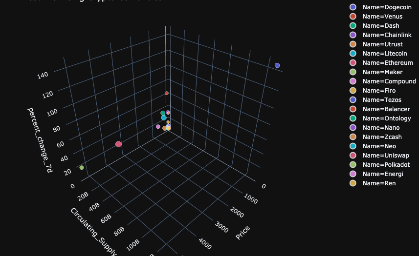
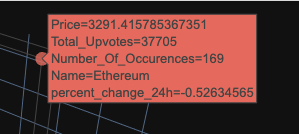
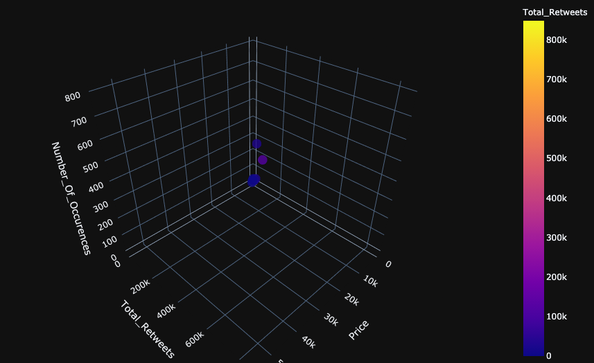
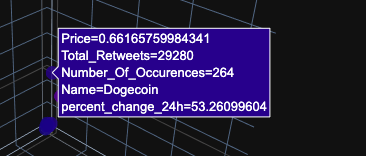
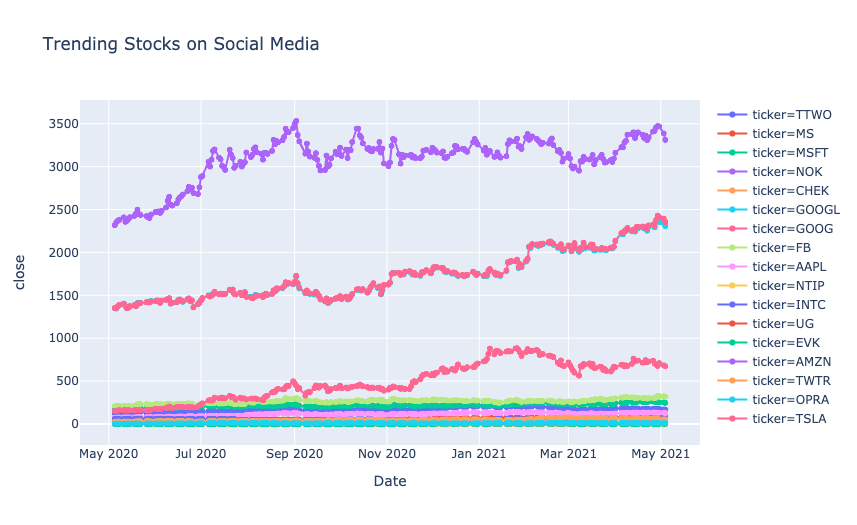
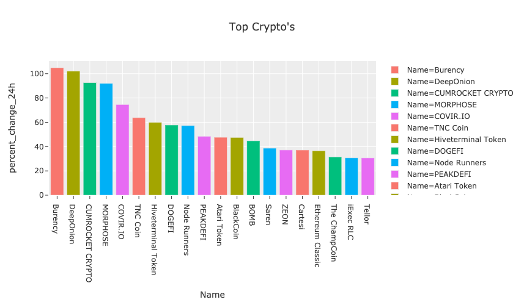
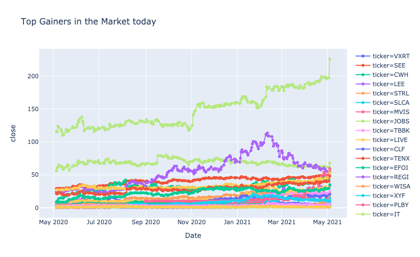

# Social Media Influence on Stocks and Crypto's

# NOTE: The project is under development 

[Link to the Website](https://social-influence-analysis.herokuapp.com/)

The objective of the project is to analyze data from social media platforms such as Twitter and Reddit with respect to the Stocks and Cryptos that can be found on certain hashtags or subreddits with the sole purpose to cross reference it with the price spikes expereinced in the market. We collect recent posts and tweets using API from reddit and twitter. It is important for us to get the current prices and spikes for all stocks and cryptos. We get the data using API from yahoo finance and coinbase respectively. Moreover, it cross references all the tweets and posts retreived with a dataFrame containing names of all stocks and crpytos to access the number of occurences of stocks or cryptos on the respective social media platform along with their number of upvotes or retweets whilst performing sentiment analysis on every post and tweet simultaneously. 

It performs Data Visualization on the top trending stocks and cryptos using libraries such as matplotlib, seaborn, plotly and so on. Furthermore, with the gathered data it attempts to create a model using the concepts of deep learning and multivariate linear regression. But to do so it need sufficient dataset on which a model can be trained. Hence, we store the collected data in SQL on daily basis {Currently trying to automate the process}.

## Installation
1. Clone the repository:
- `$ git https://github.com/VrajeshPatel20/Stocks_vs_SocialMedia.git`
2. Navigate to the cloned repository in your system.
- `$ cd Stocks_vs_SocialMedia`  
3.  Download PyCharm if it is not downloaded already:
- Download instructions & files can be found [here](https://www.jetbrains.com/help/pycharm/installation-guide.html#silent).
4. Create a virtual environment using pyCharm, replace `venv_name` with the name you would like to give.
- `$ python -m venv venv_name`
5. Activate the environment.
- `$ source ./venv_name/bin/activate`
6. Install all the requirements for this project using the provided `requirements.txt` file.
- `(venv_name) $ pip install -r requirements.txt`

You're all set now! Just have your environment activated and the run the desired modules.

## Data Analysis Results 

### Top Crypto's with maximum growth rate

### Analysis of Reddit Posts

Hover Data

### Analysis of Tweets

Hover Data

